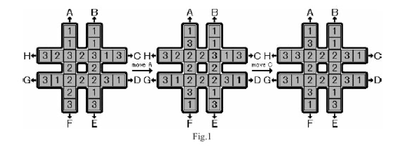

## 问题描述

有如图的棋盘，分别有8个1、2、3。可以沿A-H方向循环滑动一格里面的数字（即滑出的数字会补到空位上），例如从第一步到第二步就是沿F方向滑动。现在用尽量少的次数使中间8个数字相同，输出最小的字典序，若不需要移动则输出“No moves needed”，都要输出那个相同的数字。[题目链接](https://vjudge.net/problem/UVA-1343)



输入顺序为

|      |      | 0    |      | 1    |      |      |
| ---- | ---- | ---- | ---- | ---- | ---- | ---- |
|      |      | 2    |      | 3    |      |      |
| 4    | 5    | 6    | 7    | 8    | 9    | 10   |
|      |      | 11   |      | 12   |      |      |
| 13   | 14   | 15   | 16   | 17   | 18   | 19   |
|      |      | 20   |      | 21   |      |      |
|      |      | 22   |      | 23   |      |      |


## 分析

这道题有$\frac{24!}{8!\times 8! \times 8!}\approx9e9$种状态。因为找不到状态转移的思路和贪心以及划分为子问题求解，因此这道题应该是对状态空间树的搜索来求解。

确定了大概思路，就要想用什么方法来搜索了。

- 用dfs吗？好像节点有点多，盲目地搜索会在前面的子树中浪费过多时间而导致超时；可以用回溯法来剪枝吗？这里的状态直接好像没有显约束和隐约束，就是位置变换了一下而已，因此好像不可行。
- 用bfs吗？可以最早搜索到解，但是如果解的深度够深的话，$9e9$的空间明显不够，因此也不可行。
- 那么我们就需要采用一种兼具两者优点的方法——迭代加深搜索(IDA*)，即限定搜索下界的dfs。每次搜索失败后，就加深下界，这样就保证了搜索深度不会超过可行解的深度，同时保留了dfs的优点：线性存储的要求，避免了bfs导致的空间爆炸。虽然可能在某些情况下比dfs慢一些，但是通用性却更好。
- 乐观估计函数H(x)=当前中心8个数字最少能走几步到达全部相同的状态。

确定了方法后，就要要考虑怎么进行建图、旋转操作和判断、输出了。

- 建图：用G[24]数组来表示输入的位置。
- 旋转操作就是把对应的位置上的数重新赋值。
- G[24]数组中对应中心的数字相同了就找到了解。
- 从A-H顺序操作，把操作储存到输出字符串中，自然是最小的字典序。

##  证明

在状态空间树上bfs遍历的每个节点，迭代加深搜索都能过访问到，由于bfs的完备性，所以迭代加深搜索肯定能找到最优解。

同时每次只沿着一条路径搜索，所以空间复杂度和dfs一样是线性的。

## 代码

```c++
#include <bits/stdc++.h>
using namespace std;

const int maxn = 1e4+10;
int cent8[] = {6,7,8,11,12,15,16,17},G[24],findAns,maxDep;
char sol[maxn];
int op[][7] = {
    {0,2,6,11,15,20,22   }, //A
    {1,3,8,12,17,21,23   }, //B
    {10,9,8,7,6,5,4      }, //C
    {19,18,17,16,15,14,13}, //D
    {23,21,17,12,8,3,1   }, //E
    {22,20,15,11,6,2,0   }, //F
    {13,14,15,16,17,18,19}, //G
    {4,5,6,7,8,9,10      }  //H
};

int invOp[8] = {5,4,7,6,1,0,3,2};

void Grotate(int opNum){
    int tmp = G[op[opNum][0]];
    for(int i=0;i<=5;i++){
        G[op[opNum][i]] = G[op[opNum][i+1]];
    }
    G[op[opNum][6]] = tmp;
}

int H(){
    int cnt = 0;
    int nCnt[4]={0};
    for(int i=0;i<8;i++){
        cnt = max(cnt,++nCnt[G[cent8[i]]]);
    }
    return 8-cnt;
}

void dfs(int dep,int preOp){
    if(findAns||dep>maxDep||dep+H()>maxDep) return;
    if(!H()){
        sol[dep] = '\0';
        printf("%s\n%d\n",sol,G[cent8[0]]);
        findAns = 1;
        return ;
    }
    for(int i=0;i<8;i++){
        if(dep&&i==invOp[preOp]) continue;
        Grotate(i);
        sol[dep] = i+'A';
        dfs(dep+1,i);
        Grotate(invOp[i]);
    }
}

int main(){
    while(scanf("%d",&G[0])&&G[0]){
        for(int i =1;i<24;i++) scanf("%d",&G[i]);
        if(!H()){
            printf("No moves needed\n%d\n",G[cent8[0]]);
            continue;
        }
        findAns = 0;
        maxDep = 1;
        while (true){
            dfs(0,100);
            maxDep++;
            if(findAns) break;
        }
    }
    return 0;
}
```

## 解释

`cent8[8]`记录的是图中间的8个数字在$G[24]$中的下标。

$op[8][7]$记录的是要进行操作的数在$G[24]$中的下标。

$invOp[8]$记录的是$A-H$操作的逆操作序号，防止dfs时逆向搜索。

$H()$是乐观估计函数，统计了当前1、2、3中个数最多的数，然后求与8相补的数，就得到了最少的步数。

$maxDep$是搜索深度的下界，每次搜素失败后递增。

## 复杂度分析

$\lceil log_7(9e9) \rceil= 12$，所以树的深度为12。

时间复杂度：每次多搜索一层的时候，迭代加深搜索的节点数都是呈指数增长，由等比数列可知，最后一层搜索的节点数约等于前面搜索的所有节点数。又因为迭代加深搜索最后一层访问的节点数和bfs的节点数相同，所以其复杂度约为bfs两倍，即$O(2n)$。

空间复杂度为$O(log_7n)$。