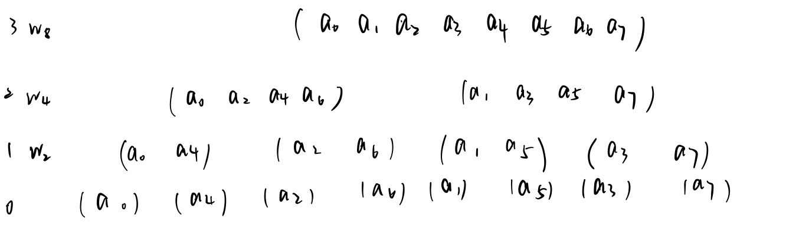
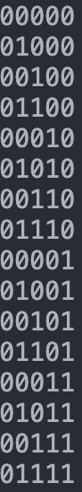

## 问题描述

用尽量短的时间

- （1）求$g(x)=f_1(x)f_2(x)$,[P3803](https://www.luogu.com.cn/problem/P3803)

- （2）求$a\times b$


## 分析

阅读书籍<a href = "#intro"><sup>1</sup></a>后，自己完全理解的基础上总结出这篇报告。

### 两个n次多项式

- 相加的最直接的方法所需时间为$\Theta(n)$($\Theta 与 f(n)$的增长速率相同)

- 相乘的最直接的方法所需时间为$\Theta(n^2)$ 

- 多项式的乘积也就是两系数向量的卷积

   $$
   设A(x)=\sum_{j=0}^{n-1}a_jx^j\\
    和B(x)=\sum_{j=0}^{n-1}b_jx^j\\
    有C(x)=\sum_{j=0}^{2n-2}c_jx^j,其中，c_j=\sum_{k=0}^{j}a_kb_{j-k}
   $$

    

### 两个数

- 把每一位看作是对应多项式的系数，即转化为问题(1)，最后进位。


对于一个多项式，可以有两种表达方式。正如对于一个信号，可以在时域上表示它，也可以在频域上表示它。一首钢琴曲，我们享受它时，是在感受它在时域上的变化，但是我们要演奏它时，却是要通过🎼上的音符来演奏，也就是从频域上来观察它，这样更简洁。

### 多项式-系数表达

对于一个$degree(A)=n$的多项式 $\sum_{j=0}^{n-1}a_jx^j$来说，我们只用得到它的系数的向量即可以表示它，$a=(a_n,a_1,\dots,a_{n-1})$

- 优点：可以快速求出在给定点$x_0$处的$A(x_0)$
  - 若直接求的话，要计算$\frac{n^2}{2}$次乘法运算和$n$次加法运算，即使用上快速幂，也是$O(nlogn)$的复杂度<a href = "#t1"><sup>t1</sup></a>
  - 有一种线性(即$O(n)$)求出系数表达多项式值的算法，叫做霍纳法则，也叫秦九昭算法<a href = "#jiuzhao"><sup>2</sup></a>
- 缺点：对于两多项式的乘积，即$c= a\bigotimes b$，时间复杂度达到$n^2$


### 多项式-点值表达

对于一个$degree = n$的多项式来说，知道曲线上的n个点，就可以确定这一条曲线，例如一次曲线用两个点可以确定，二次曲线用三个点可以确定。$\{(x_0,y_0),(x_1,y_1),\dots,(x_{n-1},y_{n-1})\}$这n个点对就可以确定一条曲线<a href = "#p1"><sup>p1</sup></a>，即一个多项式。但是这种表示方法并不是唯一的，在曲线上任取n个不同的点对都可以表示这条曲线。这n个点对的集合就是多项式的点值表达方法。

- 优点：对于$C(x)=A(x)\times B(x)$来说，只用对A、B在相同的n处取值，那么就可以求出C的点值表达$\{ (x_i,y_i)|y_i = y_{i_a}\times y_{i_b},0≤i<n \}$,这样可以$O(n)$地求出$C(x)$
- 缺点：使用点值表达计算多项式在$x_0$处的值的代价太高，为$\Theta(n^2)$<a href = "#p2"><sup>p2</sup></a>
  - 从一个多项式的点值表达确定系数表达，即求值计算的逆被称为插值。

我们可以看到，系数表达和点值表达各有优劣，且可以相互转化。

系数表达求值方便，点值表达求多项式方便。我们求$C(x)=A(x)\times B(x)$时，为了利用点值表达的$O(n)$的优点，我们可以先把系数表达转化为点值表达，计算出$C(x)$，再把点值表达转化为系数表达。正如我们可以对一个信号傅立叶变换到频域上，分析出它有哪些频率和振幅，消除某些成分，再变回去。但是两个表达的转换代价都为$O(n^2)$，我们何必多此一举呢？

### 快速傅立叶变换

既然这个过程和傅立叶变换如此相像，那么我们考察离散傅立叶变换(Discret Fourier Transform,DFT)的形式和我们求多项式值的形式。快速傅立叶变换和傅立叶变换无关，与离散傅立叶变换有关。应该叫FDFT。<font color =af0000>记住我们下面是在求多项式在n个点处的取值！！</font>
$$
DFT:\sum_{j=0}^{n-1} f(j)e^{i\omega  j},w=\frac{\pi}{N}\\
Pol:\sum_{j=0}^{n-1} a_jx^j \quad\quad\quad\quad\quad
$$
我们可以看见这个形式是非常相似的，由于x可以取任意n个不同的值，那么我们就可以巧妙地选取一些具有特殊性质的值以期望减少我们的计算量。

- x可以是复数吗？当然是可以的，复数只是扩充了数域，实数域上的性质在复数域上得到了很好的满足，使得我们更好地进行旋转和缠绕等操作，这甚至比矩阵更有优势。比如逆时针旋转90度,复数形式明显更简洁。

$$
\begin{bmatrix}
cos\theta &-sin\theta \\
sin\theta & cos\theta
\end{bmatrix},e^{-i\theta}
$$

- 既然复数的优势是旋转，那么就要选择那些旋转之后能回到原点的复数，这样的周期性经常会带来意想不到的惊喜，这些复数的模长肯定为1。记$\omega_n=e^{\frac{2\pi}{n}i}$为单位根，显然$\omega_n^n=1$，对此我们有三个引理<a href = "#p3"><sup>p3</sup></a>。
- 我们把复数代入多项式后有$y_i=A(\omega_n^i)=\sum_{j=0}^{n-1}a_j\omega_n^{ij}$，记为$y=DFT_n(a)$
- 由折半引理，我们可以看到$\omega$的重数变为了一半，因此这个问题或许可以用分治来解决。


#### 分治

$a_{2k}$比$a_{2k+1}$的次数少一，因此奇数项提出一个$x$后，两者的次数都是n/2-1。
$$
a = [a_0,a_1,a_2,a_3,a_4,...,a_{n-1}]\\
a^{[0]}=[a_0,a_2,a_4,\dotsm,a_{n-2}\quad\quad\quad],\\
a^{[1]}=[a_1,a_3,a_5,\dotsm,a_{n-1}\quad\quad\quad],\\
$$
我们可以看到对于奇偶次项，由于只是原来的一半，所以要次数要翻倍后，才是对应的次数，因此
$$
A(x)=A^{[0]}(x^2)+xA^{[1]}(x^2),\\
A(\omega_n^k)=A^{[0]}((\omega_n^k)^2)+\omega_n^kA^{[1]}((\omega_n^k)^2), \quad(1)\\
A(\omega_n^{k+\frac{n}{2}})=A^{[0]}((\omega_n^{k+\frac{n}{2}})^2)+\omega_n^{k+\frac{n}{2}}A^{[1]}((\omega_n^{k+\frac{n}{2}})^2) \quad(2)\\
$$
为什么会有(2)式呢？从下面我们可以看到$A^{[0]}和A^{[1]}$的规模只是n/2;；因此k只能取到n/2-1，所以还要求剩下的一半值。

由消去引理和折半引理可以得到(1)与(2)的化简
$$
A(\omega_n^k)=A^{[0]}(\omega_{\frac{n}{2}}^{k})+\omega_n^kA^{[1]}(\omega_{\frac{n}{2}}^{k}), \quad(1)\\
A(\omega_n^{k+\frac{n}{2}})=A^{[0]}(\omega_{\frac{n}{2}}^{k})+\omega_n^{k+\frac{n}{2}}A^{[1]}(\omega_{\frac{n}{2}}^{k}) \quad(2)\\
\omega_n^{\frac{n}{2}}是旋转180度，因此（2）式变为\\
A(\omega_n^{k+\frac{n}{2}})=A^{[0]}(\omega_{\frac{n}{2}}^{k})-\omega_n^{k}A^{[1]}(\omega_{\frac{n}{2}}^{k}) \quad(3)\\
$$
于是，求$A(x)在w_n^0,w_n^1,w_n^2...w_n^{n-1}$处的值，就被转化为了两个规模为$\frac{n}{2}$的子问题：

求$A^{[0]}和A^{[1]}$在$\omega_{\frac{n}{2}}^0,\omega_{\frac{n}{2}}^1,\omega_{\frac{n}{2}}^2...\omega_{\frac{n}{2}}^{\frac{n}{2}-1}$的取值，时间复杂度为$O(nlgn)$<a href = "#t2"><sup>t2</sup></a>

这里$\omega_n^k$被称为旋转因子


### 快速傅立叶逆变换

这里是要把我们得到的点值表达转回系数表达。

我们把DFT写成矩阵乘积$y=V_na$，$(V_n)_{ij}=\omega_n^{ij}$ ,(i、j从0开始)
$$
\begin{bmatrix}
y_0\\
y_1\\
y_2\\
\vdots\\
y_{n-1}
\end{bmatrix}
=
\begin{bmatrix}
1 & 1 & 1 &\dots & 1 \\
1 & \omega_n & \omega_1^2 &\dots & \omega_1^{n-1}\\
1 & \omega_n^2 & \omega_1^4 &\dots & \omega_1^{2(n-1)}\\
\vdots & \vdots & \vdots& \ddots &\vdots\\
1 & \omega_{n}^{n-1} & \omega_{n}^{2(n-1)} & \dots & \omega_{n}^{(n-1)(n-1)}
\end{bmatrix}
\begin{bmatrix}
a_0\\
a_1\\
a_2\\
\vdots\\
a_{n-1}
\end{bmatrix}
$$


那么 $a=V_n^{-1}y$，$(V_n^{-1})_{ij}=\frac{\omega_n^{-ij}}{n}$,这可以由$VV_n^{-1}$验证得到，简略地说，只有对应行列相乘才能避免求和引理的出现。

现在就有了$a_j=\frac{1}{n}\sum_{k=}^{n-1}y_k\omega_n^{-kj}$，这与快速傅立叶变换的式子十分相像，因此逆变换的时间也是$\Theta(nlgn)$的。另外注意这里的$\frac{1}{n}$是不像旋转因子一样递归的，只在最后出现。


最终我们就得到了解决问题的两个工具DFT与IDFT，问题的解决办法：

$a\bigotimes b = IDFT_{2n}(DFT_{2n}(a)\circ DFT_{2n}(b))$ 这里$\circ$为笛卡尔积，即对应项相乘。


##  证明

### <span name = "p1">插值多项式的唯一性</span>

$$
\begin{bmatrix}
1 & x_0 & x_0^2&\dots & x_0^{n-1}\\
1 & x_1 & x_1^2 &\dots & x_1^{n-1}\\
1 & x_2 & x_2^2 &\dots & x_2^{n-1}\\
\vdots & \vdots & \vdots& \ddots &\vdots\\
1 & x_{n-1} & x_{n-1}^2 & \dots & x_{n-1}^{n-1}
\end{bmatrix}
\begin{bmatrix}
a_0\\
a_1\\
a_2\\
\vdots\\
a_{n-1}
\end{bmatrix}
=
\begin{bmatrix}
y_0\\
y_1\\
y_2\\
\vdots\\
y_{n-1}
\end{bmatrix}
$$
该矩阵为范德蒙德矩阵，行列式为$\prod_{0\leq j<k\leq n-1}(x_k-x_j)$,此矩阵可逆，因此有唯一$a^{T}$.


### <span name = "p2">拉格朗日公式</span> 

$$
A(x)=\sum_{k=0}^{n-1}y_k\frac{\prod_{j\neq k}(x-x_j)}{\prod_{j\neq k}(x_k-x_j)}\\
$$


### <span name = "p3">三个引理</span>

- 消去引理$\omega_{dn}^{dk}=\omega_{n}^{k}$

  $\omega_{dn}^{dk}=(e^{\frac{2\pi i}{dn}})^{dk}=(e^{\frac{2\pi i}{n}})^k=\omega_{n}^{k}$

- 折半引理 $(\omega_n^{k+n/2})^2=(\omega_n^k)^2=\omega_{\frac{n}{2}}^k$

  $(\omega_n^{k+n/2})^2=(\omega_n^{k})^2\times \omega_n^n=(\omega_n^k)^2$

- 求和引理$\sum_{j=0}^{n-1}(\omega_n^k)^j$，IFFT中用到

  等比数列求和，分母为0

  

## 代码

FFT实现

```c++
#include <bits/stdc++.h>

const double PI = acos(-1);
const int maxn = 3e6+10;

inline int read(){
    int x = 0,f = 1;
    char ch = getchar();
    while (ch<'0'||ch>'9')
    {
        if(ch=='-') f= -1;
        ch = getchar();
    }
    while (ch>='0'&&ch<='9')
    {
        x = (x<<1)+(x<<3)+(ch^48);
        ch = getchar();
    }
    return x*f;
}

struct Complex{
    double r,i;
    Complex(double _r=0, double _i=0): r(_r), i(_i){}
};
Complex operator+(Complex a, Complex b){
    return Complex(a.r+b.r, a.i+b.i);       
}
Complex operator-(Complex a, Complex b){
    return Complex(a.r-b.r,a.i-b.i);
}
Complex operator*(Complex a, Complex b){
    return Complex(a.r*b.r - a.i*b.i , a.r*b.i + b.r*a.i);
}


void FFT(Complex *a, int powLim,int op){//FFT == fast-fast-tle
    if(powLim==1) return;
    Complex a0[powLim>>1],a1[powLim>>1];
    for(int i=0; i<powLim;i+=2){
        a0[i>>1] = a[i];
        a1[i>>1] = a[i+1];
    }
    FFT(a0,powLim>>1,op);
    FFT(a1,powLim>>1,op);
    Complex wn = Complex(cos(2*PI/powLim),op*sin(2*PI/powLim));
    Complex w = Complex(1,0);
    for(int k=0;k<(powLim>>1);k++){//次数界个点的值，暂存在a中
        Complex t = w*a1[k];//蝴蝶操作
        a[k] = a0[k] + t;
        a[k+(powLim>>1)] = a0[k] - t;
        w = w*wn;
    }
}
Complex A[maxn],B[maxn];
int main(){
    int n,m;
    n=read();m=read();
    for(int i=0;i<=n;i++) A[i].r = read();
    for(int i=0;i<=m;i++) B[i].r = read();
    int limit = 1;
    while(limit<=n+m) {
        limit<<=1; 
    }
    FFT(A,limit,1);
    FFT(B,limit,1);
    for(int i=0;i<=limit;i++) A[i] = A[i]*B[i];
    FFT(A,limit,-1);
    for(int i=0;i<=n+m;i++) printf("%d ",(int)(A[i].r/limit+0.5));
    return 0;
}
```


高效FFT实现

```c++
#include <bits/stdc++.h>

using namespace std;

const double PI = acos(-1);
const int maxn = (1 << 20) + 10 << 1;

int rev[maxn], len,lim = 1;

inline int read(){
    int x = 0,f = 1;
    char ch = getchar();
    while (ch<'0'||ch>'9')
    {
        if(ch=='-') f= -1;
        ch = getchar();
    }
    while (ch>='0'&&ch<='9')
    {
        x = (x<<1)+(x<<3)+(ch^48);
        ch = getchar();
    }
    return x*f;
}

struct Complex{
    double r,i;
    Complex(double _r=0, double _i=0): r(_r), i(_i){}
};
Complex operator+(Complex a, Complex b){
    return Complex(a.r+b.r, a.i+b.i);       
}
Complex operator-(Complex a, Complex b){
    return Complex(a.r-b.r,a.i-b.i);
}
Complex operator*(Complex a, Complex b){
    return Complex(a.r*b.r - a.i*b.i , a.r*b.i + b.r*a.i);
}


void FFT(Complex *a, int opt){
    for(int i=0;i<lim;i++) if(i<rev[i]) swap(a[i],a[rev[i]]);
    for(int dep =1;dep<=log2(lim);dep++){ //合并到第dep层
        int m = 1<<dep;
        Complex wn = Complex(cos(2*PI/m),opt*sin(2*PI/m));
        for(int k=0;k<lim;k+=m){ //到次数界，每组求出2^dep个点值
            Complex w = Complex(1,0);
            for(int j=0;j<m/2;j++){//当前次数界个值的的合并,合并DFT
                Complex t = w*a[k+j+m/2];
                Complex u = a[k+j];
                a[k+j] = u+t;
                a[k+j+m/2] = u-t;
                w = w*wn;
            }
        }
    }
    if(opt==-1) for(int i=0;i<lim;i++) a[i].r/=lim;
}


Complex A[maxn],B[maxn];
int main(){
    int n,m;
    n=read();m=read();
    for(int i=0;i<=n;i++) A[i].r=read();
    for(int i=0;i<=m;i++) B[i].r=read();
    while(lim<=n+m) lim<<=1,len++;
    for(int i=0;i<lim;i++) rev[i] = (rev[i>>1]>>1) | ((i&1)<<(len-1));

    FFT(A,1);
    FFT(B,1);
    for(int i=0;i<=lim;i++) A[i] = A[i]*B[i];
    FFT(A,-1);
    for(int i=0;i<=n+m;i++) printf("%d ",(int)(A[i].r+0.5));
    return 0;
}
```


这时间快了有1s！

## 解释

对于FFT的迭代实现有如下解释：

我们每次会把奇数位和偶数位的系数提出来，然后递归。如果我们知道递归时，系数的最终排列顺序，那么直接就可以合并。深入调用时产生的输入向量树，我们可以发现规律。



因为这是一个自底向上的过程，所以每一层每一组的元素个数就是$2^{dep}$,对于元素a的排列，有人发现了规律，这里称之为位逆序置换。考察最后一行的a0-a7的位置的二进制数

000 001 010 011 100 101 110 111	

000 100 010 110 001 101 011 111

因为每个数的位置都是原来位置的逆序，因此被称为位逆序置换。朴素模拟复杂度为$nlogn$，因为有n个数，每个数位为$logn$。但是我们有复杂度为$O(n)$的算法：

我们可以发现几个规律

- 偶数位上的二进制数首位为0，奇为1。

- 第2n和2n+1的数的二进制数除了首位之外都相同。

- 第2n和第2n+2的数的二进制数除了首位外是上一级子问题的解。

- 前一半的数的二进制数除了末尾外是上一级子问题的解。

  00 01 10 11

  00 10 01 11

   其实这个为位逆序置换规律也可以由0、1这两个数推出来的，观察下表可以知道除了首位外，都可以看成1、2、4、8这样的组，每一组对应的数有：有后一组的数的后lim-1位=前一组的数的前lim-1位。

    

```c++
for(int i=0;i<lim;i++)//这里次数界较高，把高次系数看作零也可以
  rev[i] = (rev[i>>1]>>1) | ((i&1)<<(len-1));   //A[rev[k]] = ak rev[k]是第k个系数在A数组中的下标/位置

(rev[i>>1]>>1) //这里是该数在上一级子问题对应集合中的位置，即上一级子问题的解，规律4
((i&1)<<(len-1)) //这里是该数所属的上一级子问题的集合，即性质1

for(int i=0;i<lim;i++) if(i<rev[i]) swap(a[i],a[rev[i]]); //进行排序，如果该数在自己的位置之前，就交换
```


## 复杂度分析

<span name = "t1"> </span>$0,1,...,n-1求和为\frac{n^2}{2}，快速幂可以用logn求出每一项，总的是nlgn$

<span name = "t2"> </span>$T(n)=2T(n/2)+\Theta(n)=\Theta(nlgn)$，有$lgn$层，每层都是$n$的代价，总的就是$\Theta(nlgn)$


参考

[1] <span name ="intro"> T. H. Cormen,et al.(著), 殷建平等(译), 算法导论(原书第三版)[M], 北京, 机械工业出版社, 2013: 527-542</span>

[2] <span name ="jiuzhao">霍纳法则</span>[OL],https://baike.baidu.com/item/霍纳法则/4822190?fr=aladdin, 2020-06-05